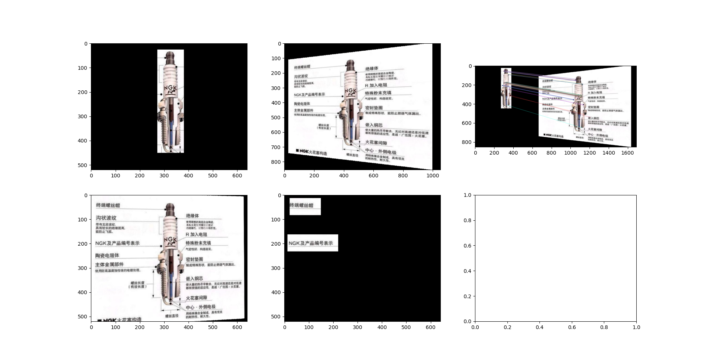
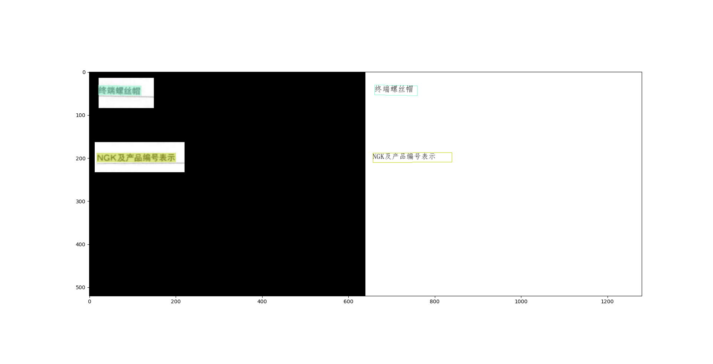
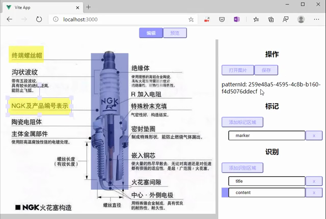
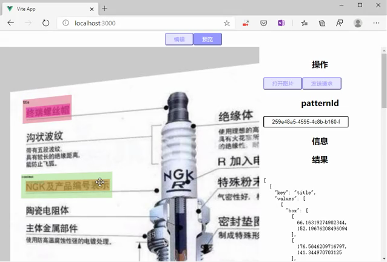

# ocr-service

自定义模板的OCR服务，没有依赖其他供应商提供的接口，可独立部署。

项目分为两端前端编辑器，后端OCR服务。

## 编辑前端

用户使用可视化方式编辑标记区域和识别区域，并为每个区域取名。然后将图片及标注信息递交到服务器。
可以进行接口测试，输入识别ID和图片后，会根据服务返回结果进行标记识别区域。

## 服务器端

接受用户上传的识别图片及标注信息，存贮后返回一个识别ID。
接受API调用。该API包含识别ID，图片。服务器端根据识别ID对图片进行OCR，并将OCR识别结果匹配标注信息，返回给请求者。

## 运行方式

以windows为例

### 单次测试识别

```powershell
# 进入到项目所在目录
.\Scripts\Activate.ps1
python ocr.py
```

首先会进行转换：取得识别图和要处理的图片，进行关键点匹配，然后根据匹配结果，去除透视并转换成和识别图大小一样，再根据标注信息，只获取识别区域。



送由OCR进行文字识别，最后根据识别区域和OCR结果拼接结果输出至控制台。



结果

```js
[{'key': 'aaa', 'values': [{'box': [[64.75059509277344, 337.30157470703125], [274.89508056640625, 330.1374206542969], [275.1041259765625, 358.523681640625], [65.05479431152344, 362.94873046875]], 'text': 'NGK及产品编号表示', 'score': 0.9979518}], 'region': {'type': 'ocrs', 'id': 2, 'key': 'aaa', 'left': 23, 'top': 173, 'width': 188, 'height': 50}, 'aera': [[70.79060363769531, 319.568603515625], [288.836669921875, 311.53704833984375], [289.2953186035156, 376.4678955078125], [71.47637939453125, 378.04541015625]]}, {'key': 'bbb', 'values': [{'box': [[66.7274169921875, 151.7689971923828], [175.9398193359375, 140.93621826171875], [176.2097625732422, 169.5221710205078], [67.04623413085938, 178.85140991210938]], 'text': '终端螺丝帽', 'score': 0.99661654}], 'region': {'type': 'ocrs', 'id': 3, 
'key': 'bbb', 'left': 32, 'top': 24, 'width': 108, 'height': 50}, 'aera': [[78.20851135253906, 143.24661254882812], [199.39175415039062, 128.02816772460938], [199.95352172851562, 190.8592987060547], [78.89080047607422, 202.44577026367188]]}]
```

### 启用web服务

```powershell
# 进入到项目所在目录
.\Scripts\Activate.ps1
$env:FLASK_APP = "main.py"
flask run
```

打开`http://localhost:5000/`即可。

标注



结果



视频说明再`documents/web.mp4`中
